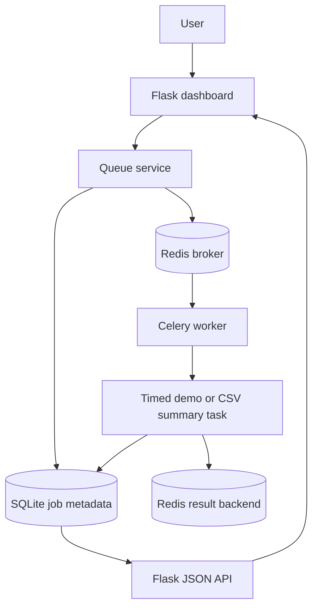

# BatchDock

### A local dashboard for submitting and monitoring background jobs

BatchDock is a lightweight local batch-processing portal inspired by research-computing workflows. It uses Flask, Celery, Redis, and SQLite to queue small background jobs, process them outside the web request, display progress, inspect structured output, review failures, and show basic worker availability from a browser dashboard.


## Features

- Submit timed demo workloads from a web interface.
- Upload a CSV file and generate a basic summary report in the background.
- Queue work through Redis and execute it with a separately started Celery worker.
- Track waiting, in-progress, finished, failed, and cancelled job states.
- Display progress bars, timestamps, readable stages, structured output, and event logs.
- Search recent jobs by ID, task type, or description.
- Filter job history by status.
- Retry failed jobs by creating a new linked job record.
- Cancel waiting jobs with Celery revocation and a worker-side cancellation check.
- Remove terminal records from local history.
- Check basic worker availability with a short Celery ping request.
- Store dashboard metadata in a small local SQLite database.
- Run automated tests without a live Redis server by using Celery's eager test mode.

## Tech stack

| Technology | Role |
| --- | --- |
| Python | Application and task logic |
| Flask | Web routes, templates, and JSON API |
| Celery | Background-task submission and worker execution |
| Redis | Celery broker and result backend |
| SQLite | Local searchable job metadata and history |
| HTML, CSS, vanilla JavaScript | Dashboard interface and polling |
| pytest | Automated checks |

## How this application works

1. The user submits a timed demo or CSV-summary job from the dashboard.
2. Flask validates the input and stores a local metadata record in SQLite.
3. The queue service submits a Celery message to Redis.
4. A separately started Celery worker receives and executes the task.
5. The task writes progress, stages, outputs, or errors into the SQLite metadata store while Celery also records task state in Redis.
6. The browser polls Flask API routes and refreshes the displayed status.
7. A failed job can be inspected and retried as a new linked job record.

## Architecture overview



## File tree

```text
batch_dock/
├── app.py
├── make_celery.py
├── requirements.txt
├── requirements-dev.txt
├── .env.example
├── LICENSE
├── ATTRIBUTION.md
├── README.md
├── MAC_SETUP.md
├── MANUAL_TESTING.md
├── INTERVIEW_GUIDE.md
├── RESUME_BULLETS.md
├── batchdock/
│   ├── __init__.py
│   ├── celery_app.py
│   ├── config.py
│   ├── routes.py
│   ├── tasks.py
│   ├── services/
│   │   ├── job_store.py
│   │   ├── queue_service.py
│   │   └── result_formatter.py
│   ├── static/
│   │   ├── css/styles.css
│   │   └── js/dashboard.js
│   └── templates/
│       ├── base.html
│       ├── dashboard.html
│       └── job_details.html
├── sample_data/example_metrics.csv
├── scripts/
│   ├── check_environment.sh
│   ├── run_tests.sh
│   └── start_redis_docker.sh
└── tests/
```

## Setup

[`MAC_SETUP.md`](MAC_SETUP.md)

[`WINDOWS_SETUP.md`](WINDOWS_SETUP.md)

## Usage examples

### Successful timed workload

- Select **Timed demo workload**.
- Use `8` steps, `1` second per step, `0` start delay, and `0` for failure step.
- Click **Queue job**.
- Open the job details page and observe progress updates.

### Controlled failure

- Submit a timed workload with `6` steps and failure step `3`.
- Open the failed job.
- Inspect the readable error and event log.
- Click **Retry**. The retry creates a new linked record and disables the deliberate failure control so the rerun can complete.

### Waiting-job cancellation

- Submit a timed workload with a `20` second start delay.
- Click **Cancel** while it is still waiting.
- The dashboard records the cancelled state and sends a Celery revoke request.

### CSV analysis

- Select **CSV summary analysis**.
- Upload `sample_data/example_metrics.csv`.
- Inspect row count, headers, non-empty counts, and numeric-column statistics in the output.

## Limitations

- BatchDock is a single-machine local demonstration.
- It does not implement authentication or user accounts.
- SQLite metadata is appropriate for this local project, not for a large distributed deployment.
- Worker status is a short-timeout ping signal. A missed reply is not absolute proof that every worker process is down.
- Dashboard cancellation is intentionally limited to waiting jobs. It does not force-terminate arbitrary running work.
- Removing a record deletes local history but does not clean up uploaded files automatically.
- CSV reports are intentionally small and basic.

